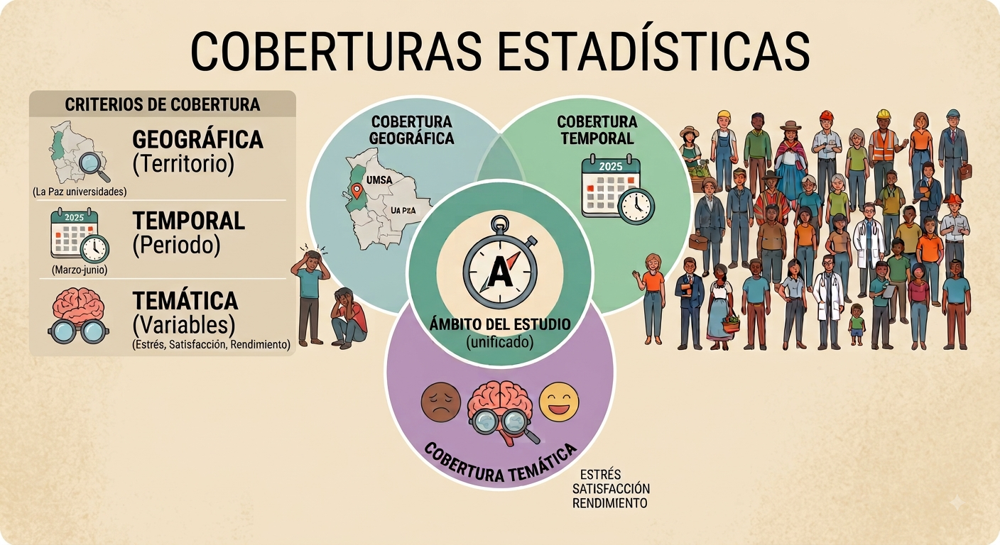
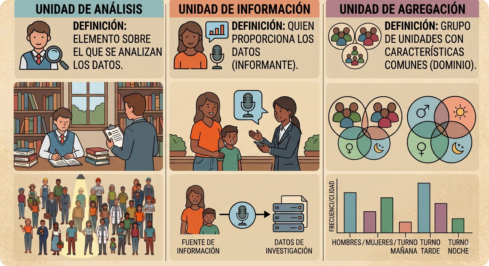
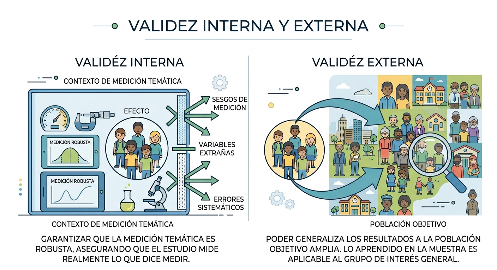
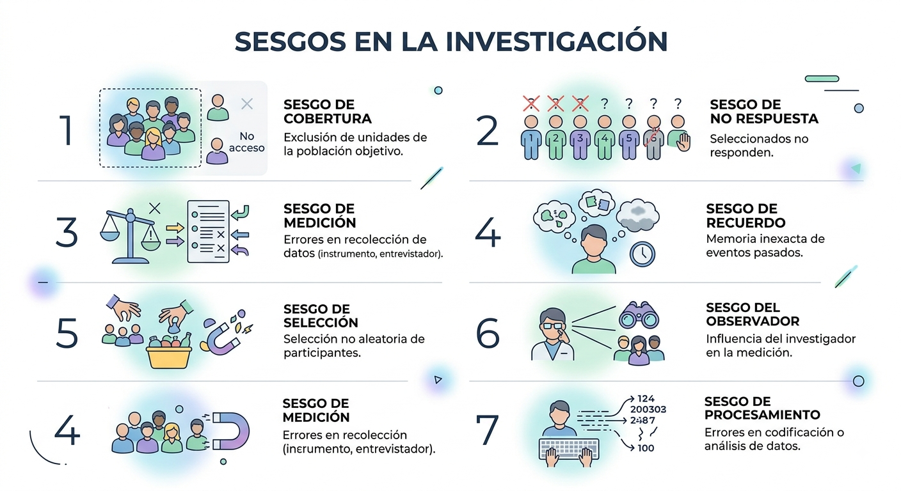
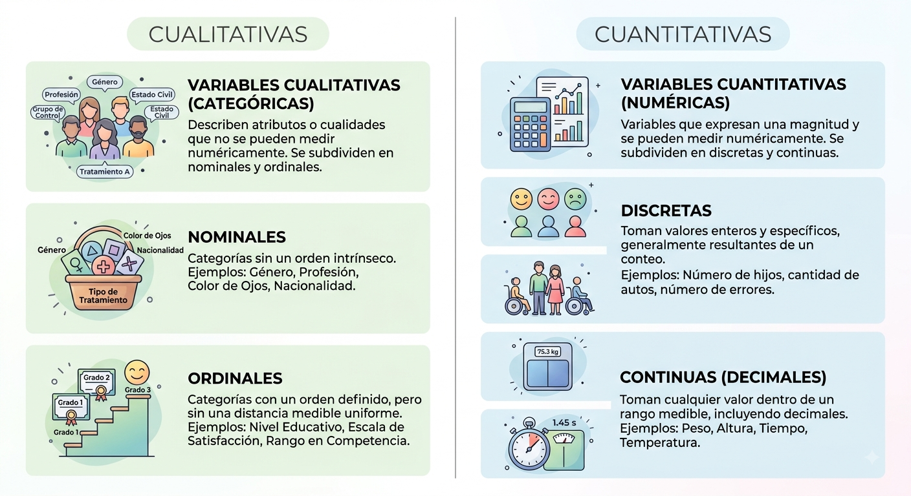
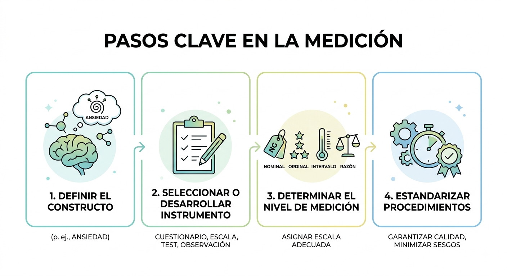

# Diseño estadístico

## ¿Qué es la estadística?

La **estadística** ha sido definida de distintas maneras según el enfoque y el contexto de aplicación:

1. **Enfoque formal:** la estadística es la ciencia que trata con la recolección, análisis, interpretación y presentación de datos [@Wackerly2008].  
2. **Enfoque aplicado:** conjunto de métodos para planificar estudios, obtener datos y analizarlos con el propósito de tomar decisiones y resolver problemas [@MontgomeryRunger2014].  
3. **Enfoque comunicativo:** el arte de **contar una historia con datos**, enfatizando la comunicación clara y contextualizada de resultados [@GelmanNolan2017].

*Ejemplo:* Analizar datos de un cuestionario de bienestar psicológico para comparar niveles de estrés entre grupos (p. ej., por semestre o género) y comunicar hallazgos que orienten intervenciones.

::: {.callout-note}
### Actividad: Contando una historia con datos (5 min)

En parejas, busquen una noticia o dato estadístico reciente que hayan visto en redes sociales o medios. Identifiquen cuál de los tres enfoques predomina en esa información: **formal** (recolección/análisis), **aplicado** (toma de decisiones) o **comunicativo** (arte de contar una historia). Compartan por qué creen que se eligió ese enfoque para el público general.
:::

## Población Objetivo (PO) — Universo

Definición:

$$
U=\{u_1, u_2, \ldots, u_N\}
$$

Donde $N$ es el tamaño del universo o la PO. Es el **conjunto total de elementos o individuos** sobre los que se quiere obtener información.

*Ejemplo:* Todos los estudiantes matriculados en Psicología en Bolivia en 2025.

::: {.callout-note}
### Actividad: Definiendo el Universo (5 min)
Imaginen que desean investigar el nivel de motivación en la carrera de Psicología. Definan con precisión la **Población Objetivo (U)** para este estudio en el contexto de la Universidad Católica Boliviana. Asegúrense de que el conjunto sea total y no deje dudas sobre quiénes forman parte de él.
:::

## Coberturas estadísticas

- **Cobertura geográfica** (*¿dónde?*): territorio o ámbito institucional del estudio.  
  *Ejemplo:* Universidades de La Paz.
- **Cobertura temporal** (*¿cuándo?*): periodo de referencia.  
  *Ejemplo:* Marzo–junio de 2025.
- **Cobertura temática** (*¿qué?*): variables o fenómenos a medir.  
  *Ejemplo:* Estrés académico, satisfacción con la carrera y rendimiento.

::: {.callout-note}
### Actividad: El mapa del estudio (7 min)
Para el estudio de "Motivación en Psicología" definido anteriormente, redacten en una hoja:

1. **Cobertura geográfica:** ¿En qué sedes o campus?
2. **Cobertura temporal:** ¿Qué meses del año 2025 o 2026?
3. **Cobertura temática:** ¿Qué variables específicas medirán (ej. horas de sueño, promedio académico, interés por la clínica)?.
:::

## Unidades estadísticas

- **Unidad de análisis/investigación:** elemento sobre el que se analizan los datos.  
  *Ejemplo:* Un estudiante.
- **Unidad de información:** quien proporciona los datos (puede coincidir o no con la unidad de análisis).  
  *Ejemplo:* Un padre/madre como informante sobre hábitos de sueño de su hijo.
- **Unidad agregada (dominio):** grupo de unidades con características comunes para análisis comparativo.  
  *Ejemplo:* Semestres, género, tipo de turno (mañana/tarde/noche).

::: {.callout-note}
### Actividad: ¿Quién es quién? (5 min)

En el siguiente caso: *"Se entrevista a los directores de colegios de La Paz para analizar el rendimiento académico de los estudiantes de primaria"*, identifiquen:

- La **Unidad de análisis**.
- La **Unidad de información**.
- Una posible **Unidad agregada** (dominio).
:::

## Fuentes de información

- **Censo:** recuento completo de la población objetivo.  
  *Ejemplo:* Censo de población y vivienda para estimar la distribución etaria.
- **Encuesta por muestreo:** medición de una parte de la población seleccionada mediante técnicas probabilísticas.  
  *Ejemplo:* Encuesta nacional de salud mental en estudiantes.
- **Estudio experimental:** recolección de datos bajo condiciones controladas para probar hipótesis y estimar efectos.  
  *Ejemplo:* Ensayo controlado sobre el impacto de mindfulness en ansiedad.
- **Estudio observacional:** registro sistemático sin manipulación de variables, en contextos naturales.  
  *Ejemplo:* Observación del uso de redes sociales y su asociación con bienestar.
- **Registro administrativo:** datos reunidos por instituciones en el curso de sus funciones.  
  *Ejemplo:* Historias clínicas o registros de atención psicológica.
  
::: {.callout-tip}
Nota: Estos pueden ser de fuente primaria (se es parte de la recolección) o secundaria (se recurre a datos ya existentes en algún lado)
:::

::: {.callout-note}
### Actividad: Selección de fuente (10 min)
Propongan qué fuente de información sería la más adecuada para los siguientes objetivos y justifiquen su elección:

- Conocer cuántos psicólogos hay en todo Bolivia.
- Saber si una nueva técnica de relajación reduce el ritmo cardíaco en tiempo real.
- Analizar la evolución de diagnósticos de depresión en un hospital público durante los últimos 10 años.
:::

## Enfoques para el análisis

- **Descriptivo:** resume y presenta información observada.  
  *Ejemplo:* Distribución de niveles de ansiedad y medidas de tendencia central.
- **Relacional/diagnóstico:** identifica asociaciones o perfiles entre variables.  
  *Ejemplo:* Correlación entre horas de sueño y rendimiento académico.
- **Predictivo:** estima valores futuros o clasifica casos.  
  *Ejemplo:* Modelo para predecir riesgo de depresión a partir de ítems de un test.
- **Causal:** evalúa el efecto de una intervención o exposición sobre un resultado, bajo supuestos de validez interna.  
  *Ejemplo:* Efecto de una técnica de estudio en la memoria de corto plazo.

### Fuentes de información × Enfoques de análisis

| Fuente / Enfoque           | Descriptivo | Relacional/Diagnóstico | Predictivo | Causal |
|----------------------------|:-----------:|:----------------------:|:----------:|:------:|
| Censo                      |     Sí      |          Sí            |     Sí     | Limitado\* |
| Encuesta por muestreo      |     Sí      |          Sí            |     Sí     | Limitado\*\* |
| Estudio experimental       |     Sí      |          Sí            |     Sí     |   Sí   |
| Estudio observacional      |     Sí      |          Sí            |     Sí     | Limitado\*\*\* |
| Registro administrativo    |     Sí      |          Sí            |     Sí     | Limitado\*\*\* |

\* Sin manipulación, requiere supuestos fuertes para inferir causalidad.  
\*\* Posible mediante diseños cuasi-experimentales (p. ej., pareamiento, IV, DiD) si la calidad del diseño/datos lo permite.  
\*\*\* Depende del control de confusión y de la estrategia de identificación.

::: {.callout-note}
### Actividad: Clasificación de objetivos (8 min)
Clasifiquen los siguientes objetivos de investigación según el enfoque de análisis (**Descriptivo, Relacional, Predictivo o Causal**):

1. Determinar si el consumo de café *causa* una mejora en la memoria de corto plazo.
2. Estimar el riesgo de deserción escolar a partir de un test de aptitud.
3. Reportar el promedio de notas de los estudiantes de primer semestre.
:::

## Validez interna y externa

- **Validez interna:** indica en qué medida los resultados de un estudio son correctos y válidos **para el conjunto específico de unidades, condiciones y periodo observados**.  
  Una alta validez interna significa que la relación observada entre variables refleja de forma precisa el fenómeno estudiado en ese contexto, sin distorsiones por factores no controlados [@Shadish2002].  
  No implica necesariamente que los resultados puedan extrapolarse a otros contextos.  
  *Ejemplo:* Un experimento controlado en un laboratorio que evalúa el efecto de una intervención psicológica en un grupo concreto de estudiantes.  

- **Validez externa:** se refiere a la **capacidad de generalizar** los resultados más allá de las condiciones del estudio, hacia otras poblaciones, contextos o momentos en el tiempo.  
  Depende de la representatividad de la muestra, de la cobertura geográfica y temporal, y de la similitud entre el contexto del estudio y el contexto al que se quiere generalizar [@Kish1995; @Shadish2002].  
  *Ejemplo:* Un estudio representativo a nivel nacional sobre depresión en adolescentes que permite inferir resultados para toda la población adolescente del país.

### Fuentes de información × Tipos de validez

| Fuente / Validez        | Interna | Externa |
|-------------------------|:-------:|:-------:|
| Censo                   | Limitada | Alta (cobertura poblacional) |
| Encuesta por muestreo   | Limitada | Alta si el muestreo es representativo |
| Estudio experimental    | Alta     | Variable (puede ser limitada por entornos artificiales) |
| Estudio observacional   | Limitada | Buena si el diseño y la muestra son adecuados |
| Registro administrativo | Variable | Buena si la cobertura y la consistencia son altas |

::: {.callout-note}
### Actividad: El dilema del laboratorio (10 min)
Discutan en grupos: Un experimento realizado con 20 voluntarios en una sala con ambiente controlado en la UCB tiene una **alta validez interna** pero una **baja validez externa**. 

- ¿Por qué el control ayuda a la validez interna?
- ¿Qué le falta para que los resultados se puedan generalizar a todos los jóvenes de Bolivia?.
:::

## Sesgos posibles en la producción de datos

En todo proceso estadístico pueden introducirse **sesgos** que afectan la validez de los resultados. Un sesgo es un error sistemático que produce estimaciones que se apartan consistentemente del valor real [@Kish1995; @Groves2009].

1. **Sesgo de cobertura**  
   Ocurre cuando ciertas unidades de la población objetivo no tienen posibilidad de ser incluidas en el marco muestral [@Kish1995].  
   *Ejemplo:* Encuesta en línea que excluye a personas sin acceso a internet.

2. **Sesgo de no respuesta**  
   Se produce cuando las personas seleccionadas para participar no responden, y su ausencia está relacionada con la variable de interés [@Groves2009].  
   *Ejemplo:* Personas con alta carga laboral no responden cuestionarios sobre estrés.

3. **Sesgo de medición**  
   Proviene de errores en la forma de recolectar la información, ya sea por el instrumento, el entrevistador o el encuestado [@Groves2009].  
   *Ejemplo:* Preguntas mal redactadas que inducen una respuesta.

4. **Sesgo de recuerdo**  
   Aparece cuando el encuestado no recuerda con precisión eventos pasados.  
   *Ejemplo:* Preguntar cuántas veces visitó un psicólogo en el último año.

5. **Sesgo de selección**  
   Surge cuando la selección de participantes no es aleatoria y está asociada con el fenómeno de interés [@Shadish2002].  
   *Ejemplo:* Seleccionar voluntarios para un experimento sobre motivación.

6. **Sesgo del observador**  
   Influencia que ejerce el investigador en la medición u observación del fenómeno.  
   *Ejemplo:* Un psicólogo que evalúa de forma diferente a pacientes según su propia expectativa.

7. **Sesgo de procesamiento**  
   Introducido durante la codificación, digitación o análisis de los datos.  
   *Ejemplo:* Errores de digitación que cambian el valor de una variable clave.

### Fuentes de información × Sesgos más probables

| Fuente / Sesgo              | Cobertura | No respuesta | Medición | Recuerdo | Selección | Observador | Procesamiento |
|-----------------------------|:---------:|:------------:|:--------:|:--------:|:---------:|:----------:|:-------------:|
| **Censo**                   |   Medio   |     Alto     |   Medio  |   Bajo   |   Bajo    |   Bajo     |     Medio     |
| **Encuesta por muestreo**   |   Alto    |     Alto     |   Medio  |   Medio  |   Medio   |   Bajo     |     Medio     |
| **Estudio experimental**    |   Bajo    |     Medio    |   Medio  |   Bajo   |   Alto    |   Medio    |     Medio     |
| **Estudio observacional**   |   Medio   |     Medio    |   Alto   |   Medio  |   Medio   |   Alto     |     Medio     |
| **Registro administrativo** |   Alto    |     Bajo     |   Medio  |   Bajo   |   Bajo    |   Bajo     |     Alto      |

**Notas:**  
- **Alto**: el sesgo es frecuente y debe controlarse activamente.  
- **Medio**: el sesgo es posible y su impacto depende del diseño y la implementación.  
- **Bajo**: el sesgo es poco probable si se siguen protocolos adecuados.

::: {.callout-note}
### Actividad: Cacería de sesgos (10 min)
Para una encuesta sobre "Hábitos de consumo de alcohol" realizada exclusivamente por Instagram a las 3:00 AM de un sábado, identifiquen al menos tres posibles **sesgos** que podrían invalidar los resultados.
:::

## Variables y tipología

Cada unidad del universo estadístico $u_i \in U$ posee una serie de **características** o **atributos** que pueden observarse o medirse [@LSJ2025].  
En estadística, estas características se denominan **variables** y constituyen la base de la información que se analiza.

Una variable es una propiedad que puede tomar distintos valores entre unidades de la población o a lo largo del tiempo [@Kish1995; @LSJ2025].  
Según su naturaleza y el tipo de análisis que permiten, las variables pueden clasificarse en:

- **Cualitativas o categóricas**: expresan atributos o categorías sin magnitud numérica intrínseca.  
  - *Nominales*: categorías sin orden (p. ej., sexo, tipo de terapia).  
  - *Ordinales*: categorías con un orden definido, pero sin distancias numéricas uniformes (p. ej., nivel educativo, escala de satisfacción).
- **Cuantitativas o numéricas**: expresan magnitudes numéricas y permiten operaciones aritméticas. Se subdividen en:  
  - *Discretas*: toman valores enteros, generalmente resultado de un conteo (p. ej., número de hijos, cantidad de sesiones de terapia).
  - *Continuas (decimales)*: pueden tomar cualquier valor en un rango, incluyendo decimales, resultado de una medición (p. ej., peso en kg, tiempo de reacción en segundos).

::: .callout-tip
La tipología de variables condiciona los métodos de análisis estadístico que pueden emplearse y afecta la validez de las inferencias [@LSJ2025].
:::

::: {.callout-note}
### Actividad: Identificación relámpago (5 min)
Clasifiquen rápidamente las siguientes variables según su naturaleza (Cualitativa nominal/ordinal o Cuantitativa discreta/continua):

- Nivel de satisfacción (Bajo, Medio, Alto).
- Número de pacientes atendidos hoy.
- Tiempo que tarda un ratón en salir de un laberinto.
- Especialidad psicológica preferida.
:::

## Medición

La **medición** es el proceso de asignar valores o categorías a las variables observadas en las unidades de análisis, siguiendo reglas previamente definidas y aceptadas [@LSJ2025; @Stevens1946].  
Su objetivo es representar un fenómeno de forma cuantitativa o cualitativa para su análisis estadístico, asegurando comparabilidad, consistencia y validez de la información recogida.

Pasos clave en la medición:

1. **Definir el constructo** o fenómeno de interés (p. ej., ansiedad).  
2. **Seleccionar o desarrollar un instrumento** de medición (cuestionario, escala, test, observación).  
3. **Determinar el nivel de medición** de cada variable (nominal, ordinal, intervalo, razón) [@Stevens1946].  
4. **Estandarizar los procedimientos** de recolección para minimizar sesgos y garantizar la calidad de los datos [@LSJ2025].

*Ejemplo:* Medir el estrés académico en estudiantes universitarios utilizando una escala validada, aplicada bajo las mismas condiciones para todos los participantes y con un protocolo claro de codificación.

::: {.callout-note}
### Actividad: Operacionalizando el constructo (10 min)
Elijan un constructo psicológico complejo. Siguiendo los pasos de medición:

1. Definan el constructo.
2. Sugieran un instrumento (test, observación, etc.).
3. Determinen el nivel de medición de la escala resultante (¿Será ordinal o de razón?).
:::